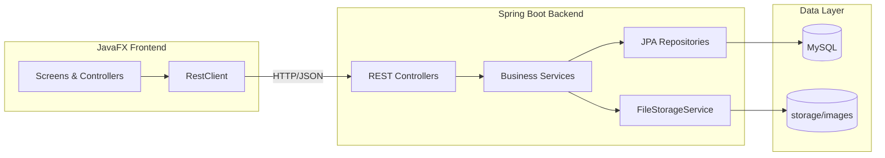

# CatConnect Architecture

## Technology requirements

- **Backend:** Java + Spring Boot (not Node, not Python)
- **Frontend:** Java + JavaFX
- **Database:** MySQL

## Overview

CatConnect uses a classic three-tier desktop architecture: JavaFX client, **Java Spring Boot** REST API, and MySQL persistence with local file storage for images.

## Backend layers

| Layer | Responsibility |
|-------|----------------|
| `controller` | HTTP endpoints, request validation |
| `service` | Business rules, transactions |
| `repository` | JPA data access |
| `entity` | Database-mapped models |
| `dto` | API request/response shapes |
| `security` | JWT authentication filter |
| `config` | CORS, storage paths, security beans |

## Frontend structure

| Package | Responsibility |
|---------|----------------|
| `app` | Application entry, navigation shell |
| `controller` | FXML screen controllers |
| `service` | API calls to backend |
| `model` | Client-side DTOs |
| `util` | Session, dialogs, image helpers |

## Image storage

Uploaded files are stored under `storage/images/{category}/{uuid}.{ext}` and served via `/api/files/**`. Categories include `moments`, `lost-found`, `adoption`, and `avatars`.

## Security

- Passwords hashed with BCrypt
- JWT issued on login; sent as `Authorization: Bearer <token>`
- Public read endpoints for directory content; write operations require authentication
